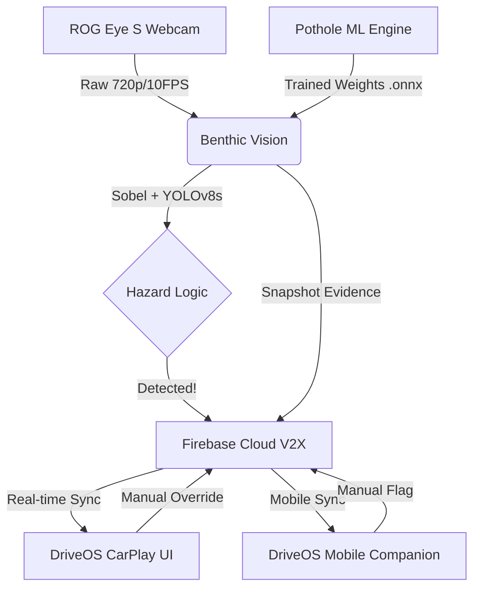

# 🚗 DriveOS: The Next-Generation Intelligent Vehicle Ecosystem

DriveOS is a comprehensive, modular intelligent vehicle ecosystem designed to bridge the gap between low-level sensor telemetry and high-level driver assistance interfaces. It combines real-time computer vision, edge-computing hazard detection, and a premium CarPlay-inspired dashboard to provide a unified V2X (Vehicle-to-Everything) experience.

---

The ecosystem is composed of five primary pillars, each handling a distinct layer of the intelligent vehicle stack.

### 1. [CarPlay UI](./carplay-ui) — *The Command Center*
The central human-machine interface (HMI). A premium, glassmorphic React dashboard that integrates maps, media, and the live Benthic AI feed.

### 2. [Benthic Vision](./benthic-vision) — *The Edge Intelligence*
The specialized vision node designed for road surface analysis. It runs high-speed on-device inference using WASM to detect potholes and surface anomalies.

### 3. [Pothole ML Engine](./pothole-ml-engine) — *The Neural Backbone*
The standalone training pipeline for fine-tuning YOLOv8 models specifically for road textures and screen-capture glare compensation.

### 4. [Backend](./backend) — *The V2X Uplink*
The infrastructure layer managing real-time data flow and vehicle telemetry synchronization.

### 5. [Mobile Companion](./driveos_mobile_app) — *The On-the-Go Mesh Node*
The high-performance Android companion designed for real-time fleet tracking and hazard synchronization via a premium Bento-Style interface.
- **Tech**: Flutter, Dart, flutter_map (CartoDB Dark).

---

## 🚀 Key Features

- **High-Speed Continuous Inference**: Real-time road scanning utilizing `requestAnimationFrame` for maximum frame throughput.
- **Temporal Persistence**: False-positive rejection logic that requires multiple consecutive detections before triggering a V2X alert.
- **V2X Mesh Networking**: Instant sharing of localized hazards across the entire DriveOS vehicle mesh.
- **Hybrid Detection**: Combines traditional Mathematical Signal Processing (Sobel Texture) with Deep Learning (YOLOv8s).

---

## 🛠️ Tech Stack & Requirements

| Component | Tech | Logo | Why? |
|-----------|------|------|------|
| **Frontend** | React / Vite |  | Rapid HMR and component-based UI isolation. |
| **Inference** | ONNX Runtime |  | Cross-platform, high-performance hardware acceleration. |
| **CV Engine** | OpenCV |  | Robust low-level pixel manipulation. |
| **Database** | Firebase |  | Low-latency real-time V2X synchronization. |
| **ML Models** | YOLOv8s |  | Optimal balance of latency and texture depth. |

---

## 🛡️ Security & Privacy
DriveOS implements strict `.gitignore` patterns and environment isolation to ensure that model weights, vehicle telemetry, and Firebase credentials are never exposed in public repositories.

---

### 📥 Getting Started
1. Clone the repository: `git clone https://github.com/ntbnaren7/drive-os.git`
2. Follow individual READMEs in subdirectories to set up each component.
    - [Setup CarPlay UI](./carplay-ui/README.md)
    - [Start Benthic Node](./benthic-vision/README.md)
    - [Train ML Model](./pothole-ml-engine/README.md)
