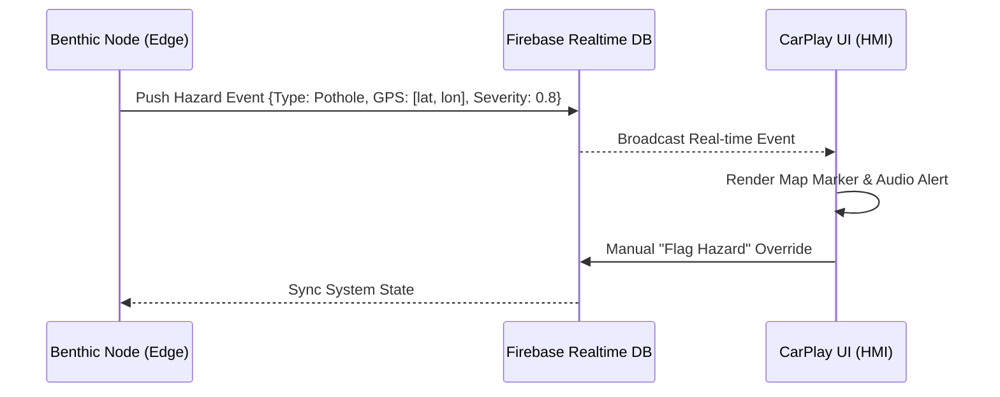

# 📂 DriveOS: Backend & Logic Services

The `backend` directory contains the core synchronization logic and data structures that power the DriveOS V2X (Vehicle-to-Everything) reality. It serves as the bridge between the Edge Sensors and the CarPlay Dashboard.

---

## 🛰️ V2X Data Flow

---

## 🧩 Core Infrastructure

### 1. Firebase Realtime Database
The backbone of DriveOS. It provides <100ms latency for synchronizing hazard events across all connected vehicle nodes.
- **Path: `/events`**: Stores detected hazards with TTL (Time-to-Live) of 10,000ms.
- **Path: `/vehicles`**: Stores current telemetry (GPS, Speed) for the vehicle mesh.

### 2. Training Utilities (`/training`)
A subset of scripts designed to interface with the ML engine directly for edge-case diagnostics.

---

## 🛠️ Tech Stack

| Component | Tech | Why? |
|-----------|------|------|
| **Database** | Firebase Realtime DB | Native Web-socket support for instant sync. |
| **Messaging** | JSON Payloads | Lightweight and compatible with both Python (ML) and JS (UI). |
| **Logic** | Python 3.11 | High-efficiency data manipulation for telemetry. |

---

## 🚦 Getting Started

1. Configure your Firebase Project at [console.firebase.google.com](https://console.firebase.google.com).
2. Download the `service-account.json`.
3. Set your `VITE_FIREBASE_*` environment variables in the frontend `.env` files.

---

## 🔐 Security (`.gitignore`)
The backend contains sensitive cloud credentials. **NEVER** push these files.
- `service-account.json`
- `credentials.json`
- `.env`
- `__pycache__/`
- `venv/`
