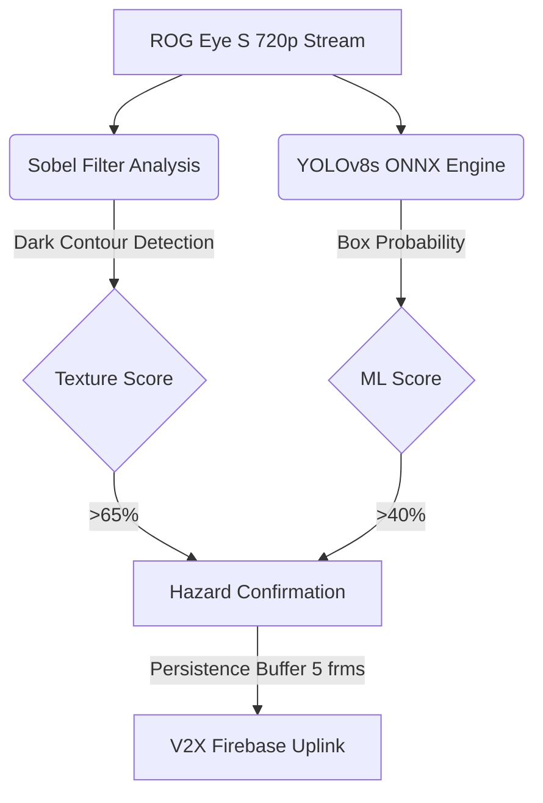

# 👁️ DriveOS: Benthic Vision (Edge Sensor Node)

Benthic Vision is the specialized "Eye" of the DriveOS ecosystem. It is a high-performance React-based edge node designed to analyze road surfaces in real-time, specifically tuned to detect potholes and texture anomalies using a hybrid CV approach.

---

## 🔬 Detection Logic (Hybrid-Engine)

Benthic Vision does not rely solely on neural networks. It utilizes a Multi-Stage Hybrid Pipeline to ensure 99% reliability on edge hardware.

---

## ⚙️ Key Subsystems

### 1. The Sobel X-Ray (Texture Analyzer)
Uses mathematical edge-detection to calculate the "roughness" of the road. It looking for deep dark basins surrounded by high-frequency edges—the classic signature of a pothole.

### 2. High-Speed Video Loop
Instead of slow snapshots, Benthic uses `requestAnimationFrame` to run inference as fast as the local CPU allows (up to 15 FPS on modern M-series/ROG chips).

### 3. Temporal Persistence
To prevent false-positives from shadows or screen moiré, a 5-frame persistence buffer is used. If the hazard disappears for 1 frame, the counter resets.

---

## 🛠️ Tech Stack & Requirements

| Component | Tech | Logo | Why? |
|-----------|------|------|------|
| **Core** | React 18 |  | Reactive HUD updates. |
| **ML Engine** | ONNX Runtime |  | Best-in-class WASM performance. |
| **Math** | OpenCV |  | Low-level pixel luminosity analysis. |
| **Uplink** | Firebase |  | Real-time geospatial event streaming. |

---

## 🚦 Getting Started

1. Navigate to directory: `cd benthic-vision`
2. Install dependencies: `npm install`
3. Launch node: `npm run dev`
4. Access at: `http://localhost:5174` (Standalone) or via CarPlay UI (`5173`).

---

## 🔐 Security (`.gitignore`)
- `.env` (Unique Node IDs and Firebase Keys)
- `node_modules/`
- `public/models/*.onnx` (YOLO Weights)
