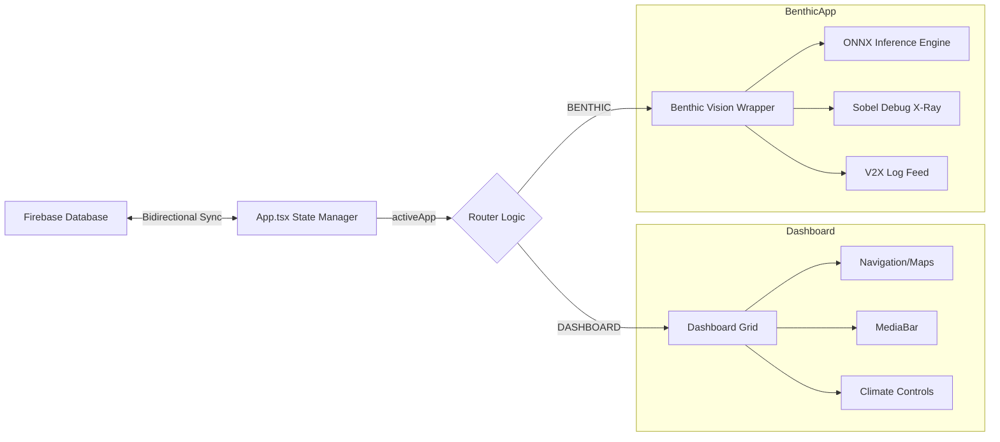

# 📱 DriveOS: CarPlay UI Dashboard

The `carplay-ui` is the primary Human-Machine Interface (HMI) for the DriveOS ecosystem. It provides a highly responsive, automotive-grade dashboard experience using modern web technologies.

---

## 🎨 Design Language: "Aero-Dark"
The UI follows a strict **Aero-Dark** design system:
- **Glassmorphism**: Backdrop-filters and translucent surfaces for a premium HUD feel.
- **Micro-Animations**: Framer Motion transitions for smooth app-switching and real-time alerts.
- **Accessibility**: High-contrast labels and oversized touch-target dock icons (min 44px).

---

## 🏗️ Architecture & Flow

---

## 🛠️ Tech Stack & Dependencies

| Tool | Version | Why? |
|------|---------|------|
| **React** | 18.3.1 | Concurrency and efficient hook-based state management. |
| **Vite** | 5.4.1 | Instant HMR and lightning-fast dev server restarts. |
| **Framer Motion** | 11.3.31 | Production-ready declarative animations. |
| **Mapbox GL** | 3.6.0 | Automotive-grade geospatial rendering. |
| **Lucide React** | Latest | Consistent 1.5px stroke weight icons. |
| **ONNX Runtime Web** | 1.20 | Hardware-accelerated ML inference in the browser. |

---

## 🚦 Getting Started

1. Navigate to directory: `cd carplay-ui`
2. Install dependencies: `npm install`
3. Launch dev environment: `npm run dev`
4. Access at: `http://localhost:5173`

---

## 🔐 Security Configuration (`.gitignore`)
This project utilizes `.env` for Mapbox and Firebase credentials. **NEVER** commit these keys. The following are ignored:
- `node_modules/`
- `dist/`
- `.env*`
- `*.local`
- `public/models/*.onnx` (Dynamic model weights)
