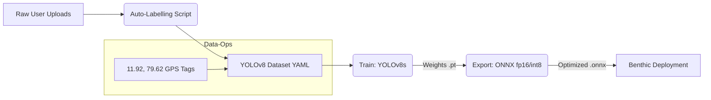

# 🧠 DriveOS: Pothole ML Engine

The `pothole-ml-engine` is the neural training ground for DriveOS. It manages the dataset, training configurations, and ONNX export pipeline for the YOLOv8s models used by the Benthic Vision nodes.

---

## 📈 ML Training Workflow

---

## 🔬 Core Components

### 1. Training Pipeline (`train_pothole.py`)
Custom training script utilizing **Ultralytics YOLOv8s**. It is configured for:
- **Image Size**: 640px (Standard)
- **Epochs**: 50 (Fine-tuning)
- **Data Augmentation**: Specifically tuned for road glare, motion blur, and varied lighting (day/night).

### 2. Export Utility (`export_onnx.py`)
Converts PyTorch `.pt` weights into high-performance `.onnx` files compatible with `onnxruntime-web`.
- **Optimization**: Opset 17, Sim-mode enabled.

### 3. Dataset Management
The engine is trained on a proprietary set of localized road images, including 100+ manual snapshots of urban potholes.

---

## 🛠️ Tech Stack & Requirements

| Component | Tech | Logo | Version |
|-----------|------|------|---------|
| **Language** | Python |  | 3.11 |
| **Framework** | PyTorch |  | 2.4.1 |
| **Model** | Ultralytics |  | Latest |
| **Hardware** | NVIDIA CUDA |  | 12.1 |

---

## 🚦 Getting Started

1. Navigate to directory: `cd pothole-ml-engine`
2. Create Venv: `python -m venv venv`
3. Activate: `.\venv\Scripts\activate` (Windows)
4. Install: `pip install ultralytics onnx onnxruntime-gpu`
5. Run Training: `python scripts/train_pothole.py`

---

## 🔐 Security (`.gitignore`)
This directory contains large binary weights and sensitive metadata.
- `venv/`
- `runs/` (Training results and weights)
- `data/images/` (Original dataset)
- `*.pt` (PyTorch Weights)
- `*.onnx` (Exported Models)
